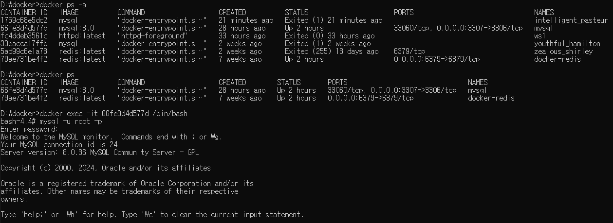

# konada-java-server

## 1. Install Docker:
 * Download and install Docker from the official website (https://www.docker.com/).
 * Ensure that the installed Docker version is 8.0 or higher by running the command docker --version in your terminal or command prompt.

## 2. Download and Install MySQL Workbench:
 * Go to the official MySQL website (https://www.mysql.com/) and download MySQL Workbench.
 * Follow the installation instructions to install MySQL Workbench on your system.

## 3. Navigate to the Directory with Docker Compose File:
 * Open a command prompt (cmd).
 * Use the cd command to navigate to the directory where your Docker Compose file is located.

## 4. Clone the Konada-java-server Repository:
 * Open a terminal or command prompt.
 * Use the git clone command to clone the Konada-java-server repository.
    - git clone https://github.com/HanKyungSung/konada-java-server.git

## 5. Navigate to the Directory with docker-compose.yml:
 * Open a terminal or command prompt.
 * Use the cd command to navigate to the directory containing your docker-compose.yml file.
 * Once you're in the directory containing docker-compose.yml, you can run the following command 
 to bring up the services with the project name 'kon'
 * docker-compose --project-name kon up -d

 ## 6. In MySQL Workbench, click on the '+' icon next to 'MySQL Connections' to create a new connection.
  * Verify that the port number is set to '3307'. You can find this in the 'Port' field. If it's not 3307, change it to 3307.
  * In the 'Username', 'password' field, enter the username and password provided in your Docker Compose configuration.
  * Once you've entered the necessary information, click on the 'Test Connection'
  
 ## 7.  All previous steps that were completely done would be assumed, and the tables will be shown like data schema. 

 ### *** If you want to check the tables, following the command prompt pic:

  #### 1. Open the command prompt and navigate the folder which is cloned with konada-java-sever
  #### 2. Write the command 'docker ps' that indicates what you have things of containers
  #### 3. Now you can see the ID of mysql, and write the command 'docker exec -it "ID HERE" /bin/bash'
  #### 4. You might accessed bash command, and write the command 'mysql -u root -p'
  #### 5. Then, you can write the password for connection ID 'root'
  #### 6. After enter the password, 'show databases;' command will show what databases you have
  #### 7. Also, write the command 'use kon;' and 'show tables' respectively

  
  

  #### then you can see what you have like this!